## 데이터를 가져오기 위한 Mybatis, mariadb 작성
----------------------------------------------

#### 1.	POM.xml 수정
----------------------------------
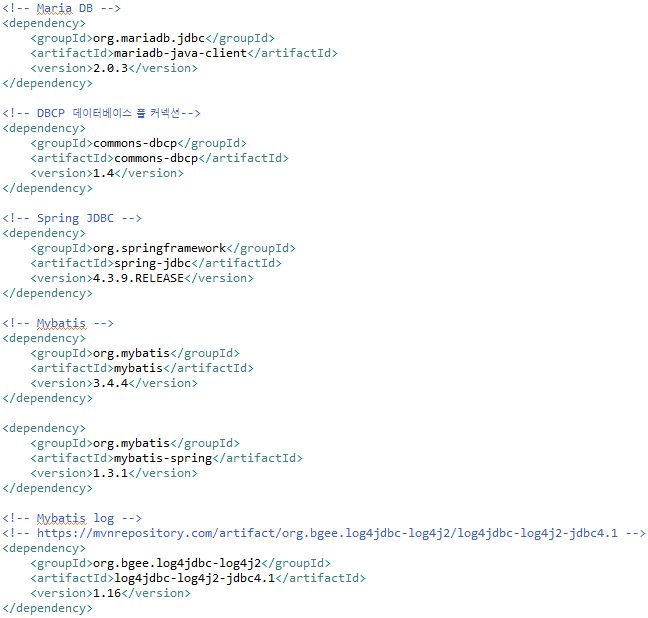

*	mariadb, mybatis 관련 dependency 추가
*	POM.xml은 POM(Project Object Model)을 설정하는 부분으로 프로젝트 내 빌드 옵션을 설정하는 부분
	*	기술된 내용을 바탕으로 필요한 라이브러리를 다운로드하거나 내장해서 프로그램을 빌드하고 실행	

#### 2. root-context.xml 수정
-------------------------
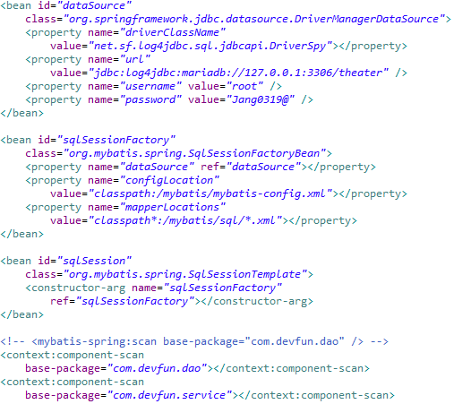

*	웹 이외의 부분을 셋팅하기 위해 존재하는 곳
	*	Service, Repository(DAO), DB 등 비즈니스 로직과 관련된 설정
*	dataSource
	>*	db 연결 정보
	>* "로컬주소/스키마"
	>* ID와 패스워드 입력
	>* 대표적인 것이 mybatis, mariadb
	
*	SqlSessionFactoryBean
	>* mariadb 설정기능을 사용하도록 세팅
	>* mapperLocation : sql문을 mybatis/sql 경로에 있는 xml 파일로 한다고 명시

*	SqlSessionTemplate
	>* 트랜잭션 관리와 쓰레드 처리, DB 연결 및 종료를 관리

* component-scan
	>* dao와 service를 등록
	>* 스프링에서 스캔을 통해 빈으로 등록하게 하기 위한 설정

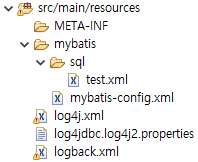

#### 3. mybatis-config.xml 작성
----------------------------------------------
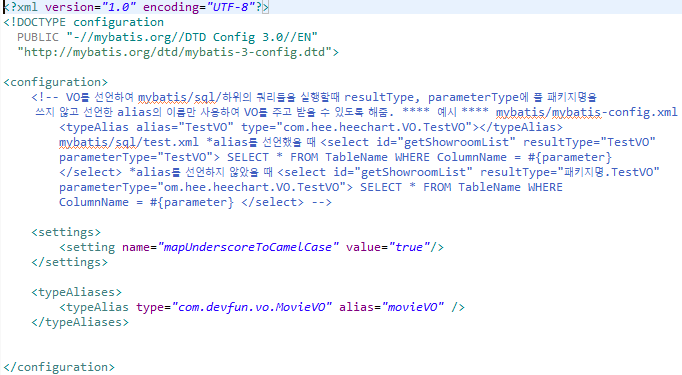

*	스프링의 설정과 별도로 사용하는 모든 Mybatis의 설정 기능을 활용

*	typeAliase
	>* 자바 타입에 대한 간단하고 짧은 이름
	>* XML 설정에만 관계
	>* 클래스 풀네임을 작성하는 수고를 덜어주기 위한 설정

#### 4. logback.xml 작성
----------------------------------------------
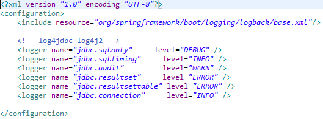

#### 5. log4jdbc.log4j2.properties 작성
----------------------------------------------
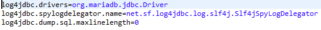

#### 6. test.xml 작성
----------------------------------------------
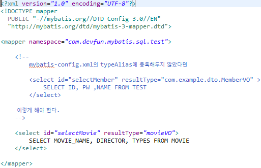

* resultType가 "movieVO"로 데이터를 movieVO에 담겠다는 것을 의미

#### 7. log4j.xml 수정
----------------------------------------------
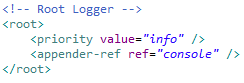

* root logger 부분의 Value를 warn에서 info로 수정

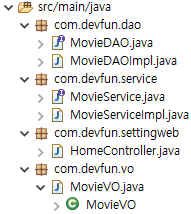

##데이터 조회/처리를 위한 JAVA코드 작성
----------------------------------------------

#### 1. MovieDAO.java 작성
----------------------------------------------
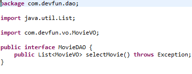

* MovieVO를 담고 있는 리스트를 가지는 함수가 있는 인터페이스를 작성

* DAO(Data Access Object)
	>* DB를 사용해 데이터를 조회하거나 조작하는 기능을 전담하도록 만든 객체

#### 2. MovieDAOImpl.java 작성
----------------------------------------------
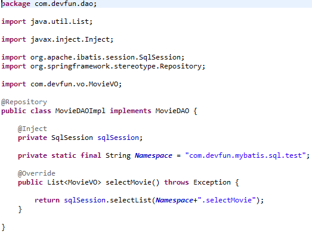

* 클래스(Class) 파일로 작성
* SqlSession을 통해 등록된 SQL 쿼리문을 실행하여 List를 리턴
* 작성 후 root-context.xml에 dao를 등록
	* 스프링에서 스캔을 통해 빈으로 등록하게 하기 위한 설정

#### 3. MovieService.java 작성
----------------------------------------------
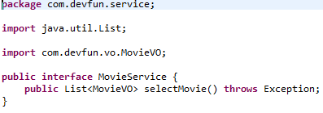

* interface로 작성
* 서비스는 비즈니스 로직을 작성하는 곳
* DB 처리를 할 때 많이 이용

* 서비스(Service)
	>* 서비스 레이어(Service Layer)단에서 세분화된 비즈니스 로직을 처리하는 객체

#### 4. MovieServiceImpl.java 작성
----------------------------------------------
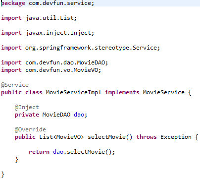

* 클래스(Class) 파일로 작성
* 작성 후 root-context.xml에 추가

#### 5. HomeController.java 작성
----------------------------------------------
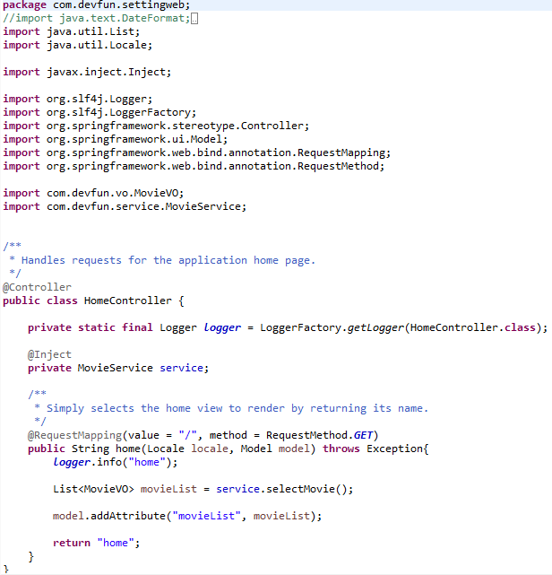

 * Controller
	>* 클라이언트에서 요청이 들어올 때, 해당 요청을 수행할 비즈니스 로직을 제어하는 객체
	>* 스프링에서는 컨트롤러에서 세부적으로 서비스 레이어(Service Layer)를 만들어 해당 요청사항을 객체 지향적인 방식으로 좀 더 세분화하여 관리
	>* service에서 selectMovie를 호출(sql 호출)하여 model에 담은 후 해당 내용을 화면으로 전달
	>* 어노테이션을 붙이면 servlet-context.xml에서 이것을 인식하여 컨트롤러로 등록
	
 * RequestMapping
	>* 호출하기 위한 url의 path
	>* "/"로 작성
	>* 요청 url을 어떤 메서드가 처리할지 여부를 결정

 * return "home"
	>* home.jsp 화면으로 전달

 * @Inject
 >* Java에서 지원하는 어노테이션
	 >* 어노테이션 : 주석처럼 코드에 달아 클래스에 특별한 의미를 부여하거나 기능을 주입
 >* 필드, 생성자, 메소드에 사용
 >* 타입으로 연결, 안되면 이름

 * model.addAttribute("이름(키)", 객체(값));
	> * 메소드를 이용하여 view에 전달할 데이터를 key, value 쌍으로하여 전달
	>* 모델을 통한 데이터 등록

#### 6. servlet-context.xml 수정
----------------------------------------------
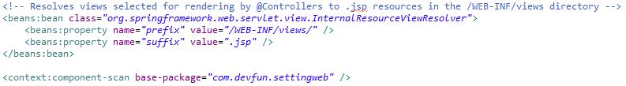

 * home.jsp의 호출 정보는 src/main/webapp/WEB-INF/spring/appServlet/servlet-context.xml에 beans로 views에 있는 jsp파일로 호출하겠다는 정보에서 확인 가능
 >* jsp와 관련 있는 객체(bean)를 설정(controller, MultipartResolver(파일 업로드), Interceptor(로그인) 등)
 >* WEB Application에서 Client의 요청을 받기 위한 설정
 >* 클라이언트의 요청을 처리하기 위한 view(uri) 관련 설정

#### 7. home.jsp 작성
----------------------------------------------
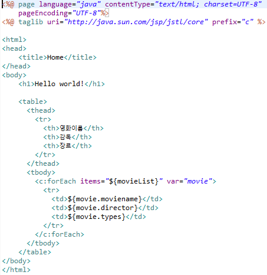

* movieList를 받아 c:forEach 문으로 조회된 결과를 뿌려줌

#### 8. MovieVO.java 작성
----------------------------------------------
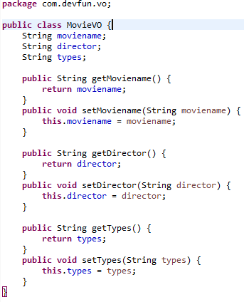

 * VO(Value Object)
	>* 각 계층간 데이터 교환을 위한 자바 객체를 의미
	>* 이 객체는 데이터를 각 레이어 간에 전달하는 목적
	>* 객체의 속성과 getter, setter만 가지고 있음
	>* DTO(Data Transfer Object)로 불릴 수도 있음

#### 결과
----------------------------------------------
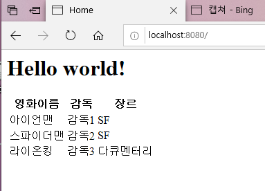

