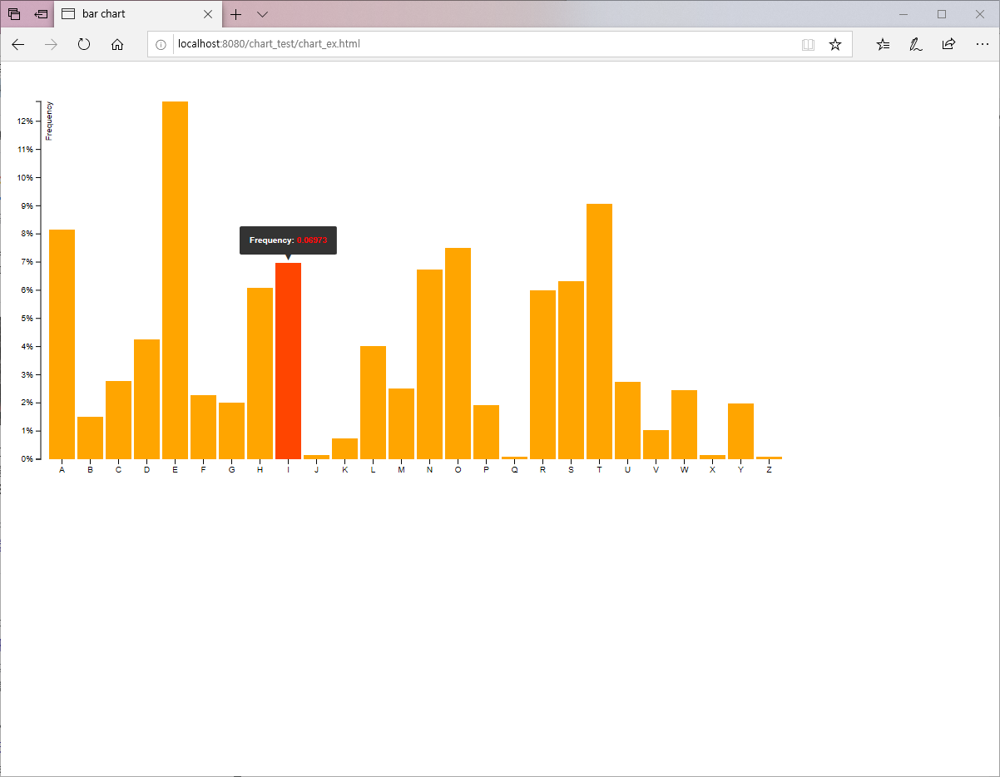

#### 1. 차트 선택
----------------------------------
*	d3.js
	*	Bar chart with tooltips 선택	

#### 2. 차트 테스트
-------------------------
* dynamic web project 이용
* Data 인터페이스 (data.tsv) 작성 (완료)
* chart_ex.html 작성 (완료)
* Tomcat 서버 구성 (완료)

#### 3. 차트 데이터 가이드 작성 (완료)
----------------------------------------------

#### 4. 결과 화면
----------------------------------------------

