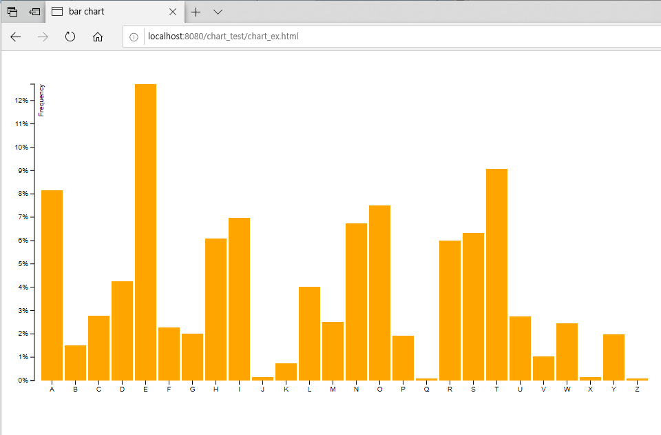

## [Bar Chart] tsv 응답 가이드 Version 1.0
----------------------------------------------

개정 이력 : 2020-02-13
버전 : 1.0
변경일 : 최초작성
변경사유 : 최초작성
변경내역 : 최초작성
작성자 : 장예림

#### 목차
----------------------------------
1.	요청

2.	응답

3.	chart library 정보

4.	차트 샘플

#### 1. 요청
----------------------------------
* 시각화 메인 화면에서 1개의chart를 설정할 수 있습니다.
* 사용자가 1개의chart 데이터를 요청하면 데이터를 가져와 차트를 그립니다.
	

#### 2. 응답
-------------------------
* TSV Type으로 chart를 위한 데이터를 제공합니다.
* Encoding 방식은 UTF-8 입니다.
* TSV 형식은 아래와 같습니다.

>letter	frequency
>A	.08167
>B	.01492
>C	.02780
>D	.04253
>E	.12702
>F	.02288
>G	.02022
>H	.06094
>I	.06973
>J	.00153
>K	.00747
>L	.04025
>M	.02517
>N	.06749
>O	.07507
>P	.01929
>Q	.00098
>R	.05987
>S	.06333
>T	.09056
>U	.02758
>V	.01037
>W	.02465
>X	.00150
>Y	.01971
>Z	.00074

* letter : x축 라벨
* frequency : y축 라벨

#### 3. chart library
----------------------------------------------
*	https://d3js.org
*	http://bl.ocks.org/caged/6476579 

#### 4. 차트샘플
----------------------------------------------

