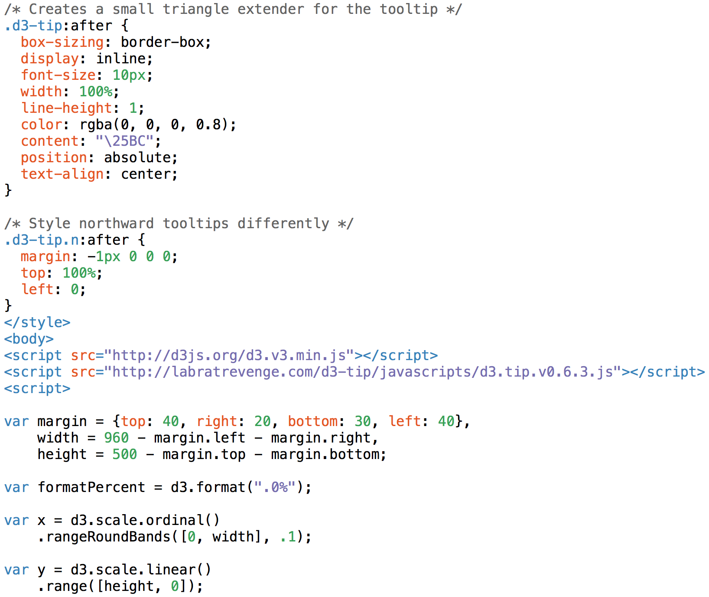

## 차트 테스트
----------------------------------------------

#### 1. 테스트 구조
----------------------------------

* dynamic web project 이용
	>* 동적인 웹페이지를 웹어플리케이션 개발시 사용하는 프로젝트
	>* JSP/Servlet을 사용하는 웹 개발 방법
	

#### 2. chart_ex.html 작성
-------------------------

* Bar chart with tooltips 이용
*  data.tsv 영역을 보면 데이터를 읽어오고 있음을 확인 가능
* d3.js의 문법을 통해 해당 차트를 그리고 있음

>* d3.js : 차트를 동적으로 이용하게 하는 svg 이미지를 기본으로 다루는 오픈소스 차트

#### 3. data.tsv 작성
----------------------------------------------

* 해당 파일은 Data 인터페이스
 >* tsv란 tab으로 데이터를 구분하는 문서를 의미

#### 4. 결과
----------------------------------------------

