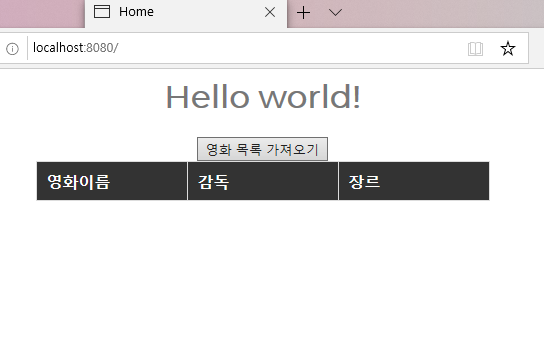

## DataBinding을 위한 화면 구조 변경, 자원 작성
------------------------------------------------

* restController 이용
	* restController로 데이터를 호출
	* 해당 데이터를 html의 Dom 영역에 데이터를 바인딩

#### 1. home.jsp 작성
----------------------------------

* < tbody > 태그 jstl 문법 제거, 영역 id 매기기
* < head > 태그 안에 home.js, home.css 추가
* 영화 목록 가져오기 버튼 추가
* jquery-1.12.4.min.js cdn 방식으로 추가
	* FrontEnd(화면) 개발을 쉽고 빠르게 하기 위한 library

#### 2. servlet-context.xml 수정
----------------------------------------------

* 자원을 웹에서 읽어오기 위해서 자원이 있는 곳을 맵핑

#### 3. home.css 작성
--------------------------------

* 웹페이지의 디자인을 위한 파일

#### 4. home.js 작성
------------------------------

* 화면에서 동적으로 이용할 javascript 코드
* 버튼을 클릭하면 url을 통해 데이터 호출(restController)
* 호출 성공시 dataBinding
* $로 시작
	* 현재 jquery를 이용해 개발하고 있음을 의미
	* home.jsp 파일에서 해당 라이브러리를 불러오고 있음을 확인
* $(document).ready 영역
	* html 구조를 먼저 모두 읽은 후 코드를 수행
	* home.jsp의 태그 및 구조를 모두 읽고 load_movieList 함수를 호출
	* 데이터 바인딩할 영역을 불러오지 못했지만 데이터를 바인딩하는 경우, 해당 영역을 찾지 못해 오류가 발생하는 요인. 오류가 나지 않도록 태그를 먼저 읽을 수 있도록 처리하는 영역
* $.ajax 영역
	* WAS(SPRING) 영역
	* 데이터를 호출하기 위해 jquery에서 제공해주는 방법
	* 호출을 위한 url, 서버에 전송할 data, 호출 전 수행할 코드, 동기/비동기 방식 여부 등을 설정 후 데이터 호출
* List방식으로 데이터를 가져오기 때문에 데이터 호출 성공시 < tr > .. < /tr >형식의 태그를 동적으로 만들어 id가 movieList인 영역에 Data를 바인딩

#### 5. 결과
----------------------------------------------

