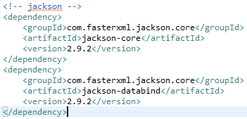
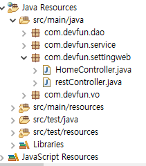
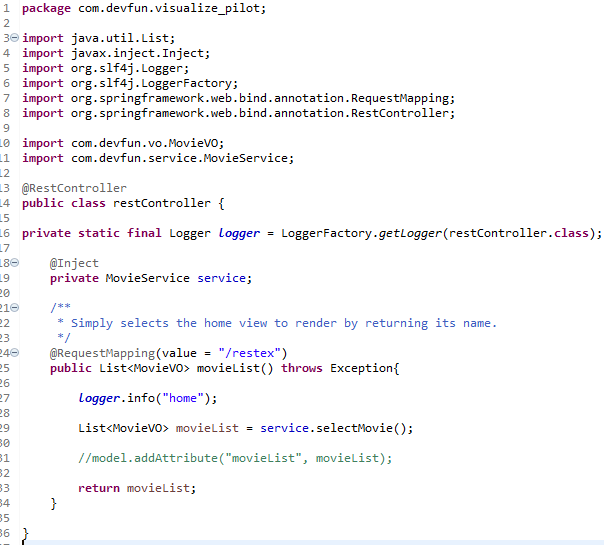
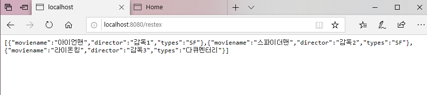

#### Spring : RestController을 이용한 데이터 처리
------------------------------------------------

#### 1. json을 이용하기 위한 Jackson library를 추가
----------------------------------

* pom.xml에 Jackson library 추가 후 저장
>* 자동으로 library를 mvnrepository에서 가져옴

#### 2. restController 파일 작성
-------------------------

* RestController를 이용한 List<json> 리턴

