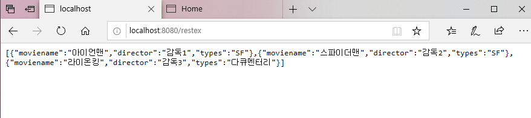

#### 1. Spring : RestController을 이용한 데이터 처리
----------------------------------
* pom.xml에 Jackson library 추가 (완료)
* restController 파일 작성 (완료)
* RestController를 이용한 List<json> 리턴 (완료)

#### 2. DataBinding을 위한 화면 구조 변경, 자원 작성
-------------------------
* home.jsp 수정 (완료)
* home.js, home.css 파일 추가 후 작성 (완료)
* jquery-1.12.4.min.js cdn 방식 활용 (완료)

#### 3. 결과
----------------------------------------------

