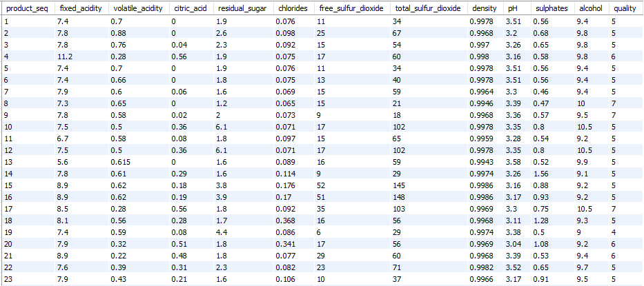
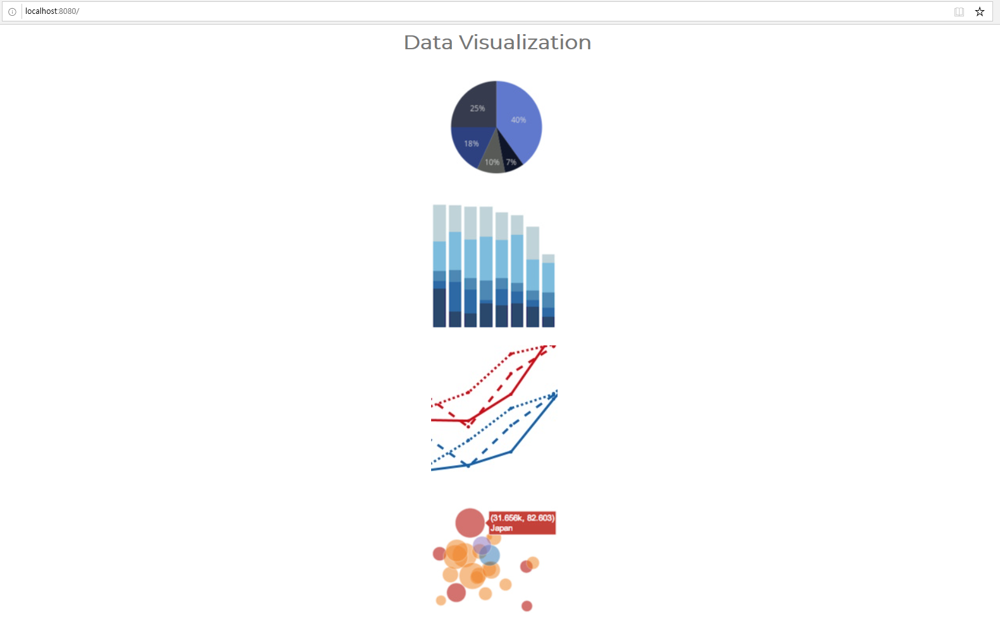
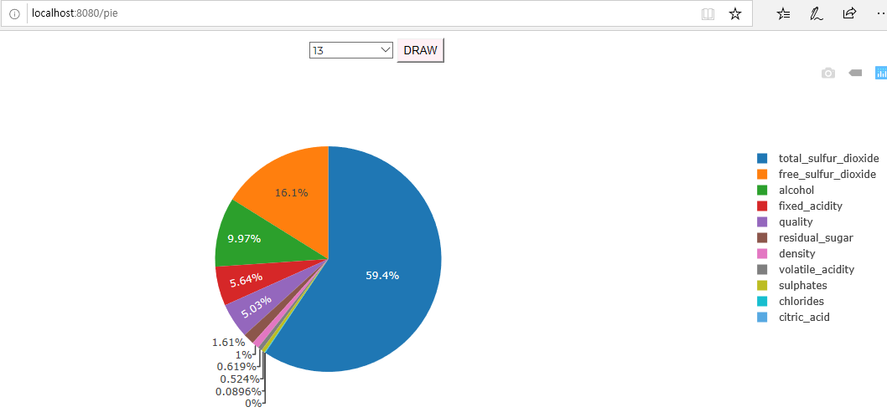
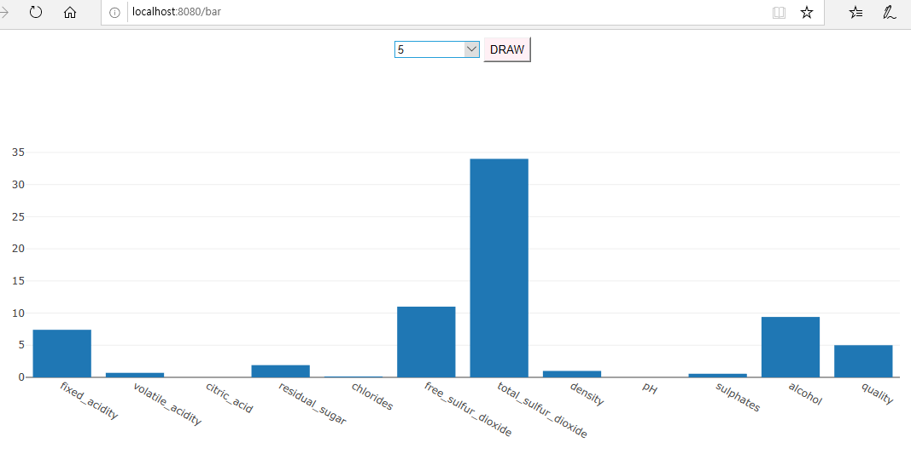
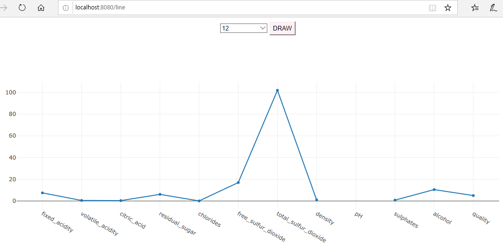
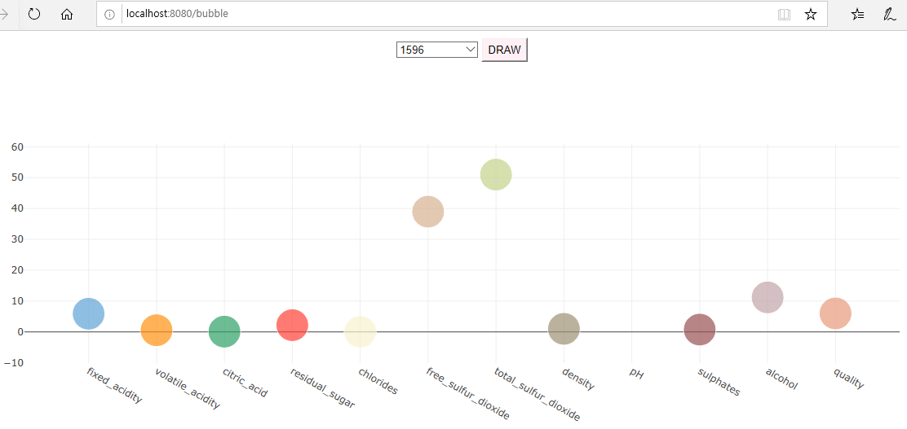

#### 1. 차트 데이터에 활용할 데이터 만들기
----------------------------------

* wine_quality 스키마 생성 (완료)
* product_quality 테이블 생성 (완료)
* csv파일의 Data를 Insert (완료)

#### 2. 데이터 시각화 페이지 구축
----------------------------------------------

* Plotly 활용
* Home 구현 (완료)

